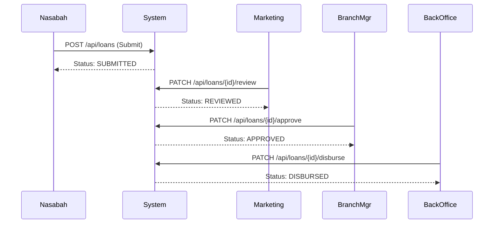

# 🗺️ Pemetaan API Endpoint & Alur Sistem

Dokumen ini berisi pemetaan lengkap seluruh endpoint API yang tersedia di sistem Plapofy dan alur kerjanya.

---

## 🔐 1. Authentication (`/api/auth`)
*Public endpoints (tidak perlu token)*

| Method | Endpoint | Deskripsi | Request Body |
|:---|:---|:---|:---|
| `POST` | `/api/auth/login` | Login user & dapatkan JWT | `{"username": "...", "password": "..."}` |
| `POST` | `/api/auth/register` | Daftar user baru (Role Default: NASABAH) | `{"username": "...", "email": "...", "password": "..."}` |
| `POST` | `/api/auth/reset-password` | Reset password user | `{"email": "...", "newPassword": "..."}` |
| `POST` | `/api/auth/logout` | Logout user (Client side clear token) | - |

---

## 👥 2. User Management (`/api/users`)
*Hanya untuk `SUPER_ADMIN`*

| Method | Endpoint | Deskripsi |
|:---|:---|:---|
| `GET` | `/api/users` | List semua user |
| `GET` | `/api/users?branchId=X` | **[BARU]** List user difilter berdasarkan cabang ID X |
| `POST` | `/api/users` | Buat user internal baru |
| `PUT` | `/api/users/{id}` | Update data user |
| `PATCH` | `/api/users/{id}/status` | Aktifkan/Nonaktifkan user |
| `PATCH` | `/api/users/{id}/branches` | **[BARU]** Assign user ke cabang tertentu |
| `DELETE` | `/api/users/{id}` | Soft delete user |

---

## 🏢 3. Branch Management (`/api/branches`)

| Method | Endpoint | Role | Deskripsi |
|:---|:---|:---|:---|
| `GET` | `/api/branches` | Public/Auth | List semua cabang aktif |
| `GET` | `/api/branches/{id}` | Public/Auth | Detail cabang |
| `POST` | `/api/branches` | `SUPER_ADMIN` | Buat cabang baru |
| `PUT` | `/api/branches/{id}` | `SUPER_ADMIN` | Update cabang |
| `DELETE` | `/api/branches/{id}` | `SUPER_ADMIN` | Hapus cabang |

---

## 💰 4. Loan Management (`/api/loans`)

### Alur Pengajuan Pinjaman

| Method | Endpoint | Role | Deskripsi |
|:---|:---|:---|:---|
| `POST` | `/api/loans` | `NASABAH` | Ajukan pinjaman baru |
| `POST` | `/api/loans/submit-kyc` | `NASABAH` | Ajukan pinjaman + Upload KTP/Selfie |
| `GET` | `/api/loans` | Internal | List semua pinjaman |
| `GET` | `/api/loans/{id}` | Internal | Detail pinjaman |
| `POST` | `/api/loans/simulate` | Public | Simulasi cicilan |
| `PATCH` | `/api/loans/{id}/review` | `MARKETING` | Review pengajuan |
| `PATCH` | `/api/loans/{id}/approve` | `BRANCH_MANAGER` | Setujui pengajuan |
| `PATCH` | `/api/loans/{id}/reject` | BM / BO | Tolak pengajuan |
| `PATCH` | `/api/loans/{id}/disburse` | `BACK_OFFICE` | Cairkan dana |

---

## 👤 5. Customer Profile (`/api/profile` & `/api/customers`)

| Method | Endpoint | Role | Deskripsi |
|:---|:---|:---|:---|
| `GET` | `/api/profile` | Auth User | Lihat profil nasabah sendiri |
| `PUT` | `/api/profile` | Auth User | Update profil nasabah sendiri |
| `GET` | `/api/customers` | `SUPER_ADMIN` | List semua data nasabah |

---

## ⚙️ 6. System Configuration (`/api/roles`, `/api/permissions`, `/api/menus`)
*Hanya untuk `SUPER_ADMIN`*

Digunakan untuk mengatur Role-Based Access Control (RBAC) dinamis.

- **Roles**: Mengatur nama role (misal: "MARKETING", "SUPER_ADMIN").
- **Permissions**: Mengatur hak akses granular (misal: "loan.create", "user.view").
- **Menus**: Mengatur menu sidebar yang muncul untuk setiap role.
