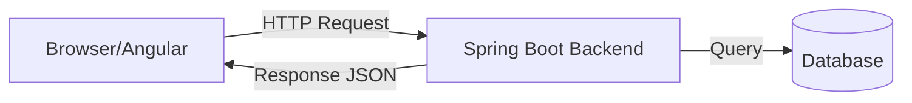
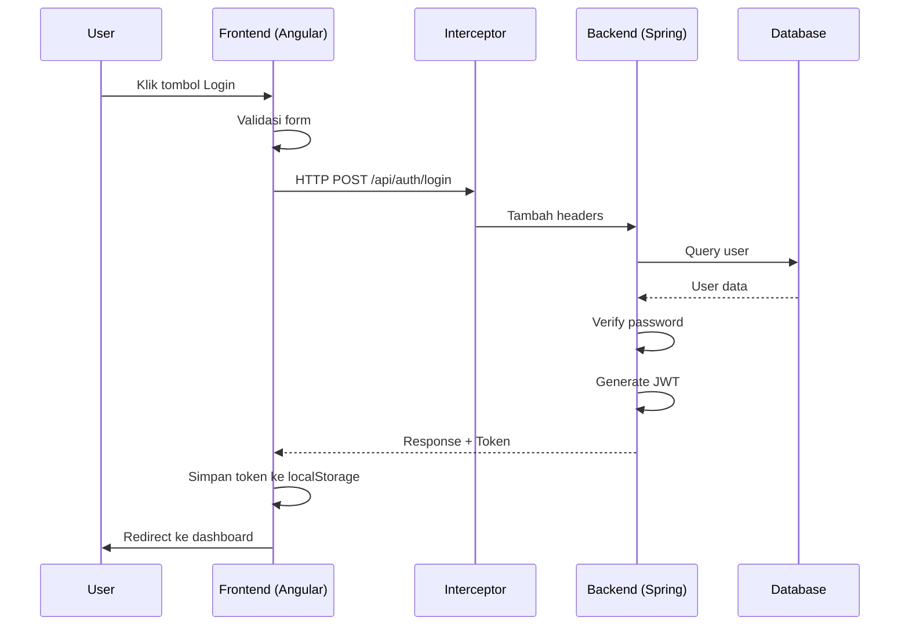
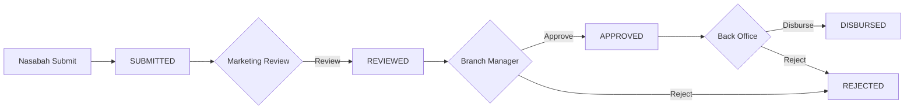

# 📚 Panduan Belajar: Java Spring Boot & Angular

**Untuk Pemula yang Baru Pertama Kali Belajar Java dan Angular**

Dokumen ini menjelaskan konsep-konsep kunci dengan contoh langsung dari kode proyek Plapofy Anda.

---

## Daftar Isi

1. [Pengantar Arsitektur](#1-pengantar-arsitektur)
2. [Konsep Dasar Java Spring Boot](#2-konsep-dasar-java-spring-boot)
3. [Konsep Dasar Angular/TypeScript](#3-konsep-dasar-angulartypescript)
4. [Studi Kasus: Alur Login (End-to-End)](#4-studi-kasus-alur-login-end-to-end)
5. [Studi Kasus: Alur Loan](#5-studi-kasus-alur-loan)
6. [Ringkasan Konsep Penting](#6-ringkasan-konsep-penting)

---

## 1. Pengantar Arsitektur



### Bagaimana Frontend dan Backend Berkomunikasi?

1. **Frontend (Angular)** → Membuat HTTP request ke URL tertentu
2. **Backend (Spring Boot)** → Menerima request, proses, dan kirim response
3. **Format Data** → JSON (JavaScript Object Notation)

**Contoh Request:**
```
POST /api/auth/login
Body: { "username": "admin", "password": "admin123" }
```

**Contoh Response:**
```json
{
  "success": true,
  "message": "Authenticated",
  "data": {
    "token": "eyJhbGciOiJIUzI1NiJ9...",
    "username": "admin",
    "roles": ["ROLE_SUPER_ADMIN"]
  }
}
```

---

## 2. Konsep Dasar Java Spring Boot

### 2.1 Annotations (Penanda Khusus)

Annotations adalah penanda yang memberitahu Spring cara memperlakukan class/method/field.

#### Dari file [Role.java](file:///c:/Users/prasa/Desktop/BootcampITDP12/finprov2%20-%20Copy/src/main/java/com/finprov/loan/entity/Role.java):

```java
@Entity                          // Tandai bahwa class ini adalah tabel database
@Table(name = "roles")           // Nama tabel di database = "roles"
@Data                            // Lombok: auto-generate getter, setter, toString
@Builder                         // Lombok: buat builder pattern
@NoArgsConstructor               // Lombok: buat constructor kosong
@AllArgsConstructor              // Lombok: buat constructor dengan semua parameter
public class Role {

  @Id                            // Field ini adalah Primary Key
  @GeneratedValue(strategy = GenerationType.IDENTITY)  // Auto-increment
  private Long id;

  @Column(name = "role_name", nullable = false, unique = true)
  private String name;           // Kolom di database: role_name, tidak boleh NULL, harus unik
}
```

**Penjelasan Sederhana:**
| Annotation | Arti |
|------------|------|
| `@Entity` | "Class ini mewakili tabel database" |
| `@Table(name = "roles")` | "Nama tabelnya adalah 'roles'" |
| `@Id` | "Field ini adalah primary key" |
| `@Column(...)` | "Ini adalah kolom di database dengan aturan tertentu" |
| `@Data` | "Buatkan getter/setter otomatis" (dari Lombok) |
| `@Builder` | "Buatkan pola builder" (dari Lombok) |

---

### 2.2 Dependency Injection (DI)

**Konsep:** Daripada membuat objek sendiri (`new SomeClass()`), Spring akan "menyuntikkan" objek yang dibutuhkan.

#### Dari file [AuthServiceImpl.java](file:///c:/Users/prasa/Desktop/BootcampITDP12/finprov2%20-%20Copy/src/main/java/com/finprov/loan/service/impl/AuthServiceImpl.java):

```java
@Service                           // Tandai bahwa ini adalah Service (business logic)
@RequiredArgsConstructor           // Lombok: auto-generate constructor untuk final fields
public class AuthServiceImpl implements AuthService {

  // Spring akan OTOMATIS menyuntikkan objek-objek ini
  private final UserRepository userRepository;
  private final RoleRepository roleRepository;
  private final PasswordEncoder passwordEncoder;
  private final JwtTokenProvider jwtTokenProvider;

  // Anda tidak perlu new UserRepository(), Spring yang handle
}
```

**Analogi:**
Bayangkan Anda bekerja di restoran. Anda butuh pisau, spatula, dan panci. Daripada Anda pergi ke toko dan beli sendiri, manajer restoran (Spring) sudah menyediakan semuanya untuk Anda.

---

### 2.3 Layer Architecture

Spring Boot menggunakan layer architecture:

```
┌─────────────────────────────────────────────────┐
│  Controller Layer                               │
│  ↓ Menerima HTTP request, kirim response        │
├─────────────────────────────────────────────────┤
│  Service Layer                                  │
│  ↓ Business logic                               │
├─────────────────────────────────────────────────┤
│  Repository Layer                               │
│  ↓ Akses database                               │
├─────────────────────────────────────────────────┤
│  Entity                                         │
│  Representasi tabel database                    │
└─────────────────────────────────────────────────┘
```

#### Controller - Dari [AuthController.java](file:///c:/Users/prasa/Desktop/BootcampITDP12/finprov2%20-%20Copy/src/main/java/com/finprov/loan/controller/AuthController.java):

```java
@RestController                    // Ini adalah REST API controller
@RequestMapping("/api/auth")       // Semua endpoint di controller ini dimulai dengan /api/auth
@RequiredArgsConstructor
public class AuthController {

  private final AuthService authService;  // Inject service

  @PostMapping("/login")           // Handle POST request ke /api/auth/login
  public ResponseEntity<ApiResponse<LoginResponse>> login(@RequestBody LoginRequest requestBody) {
    LoginResponse data = authService.login(requestBody);   // Panggil service
    return ResponseEntity.ok(ApiResponse.of(true, "Authenticated", data));  // Kirim response
  }
}
```

**Penjelasan:**
- `@PostMapping("/login")` → "Method ini handle POST request ke /api/auth/login"
- `@RequestBody` → "Ambil JSON dari body request dan konversi ke objek Java"
- `ResponseEntity<...>` → "Bungkus response dengan HTTP status code"

---

### 2.4 Repository (Akses Database)

Repository adalah interface yang otomatis diimplementasikan Spring untuk akses database.

```java
public interface UserRepository extends JpaRepository<User, Long> {
    // Spring OTOMATIS membuat query berdasarkan nama method!
    Optional<User> findByUsername(String username);
    
    // Method ini akan menghasilkan query:
    // SELECT * FROM users WHERE username = ?
}
```

**Query Method Magic:**
| Method Name | SQL yang Dihasilkan |
|-------------|---------------------|
| `findByUsername(String)` | `SELECT * FROM users WHERE username = ?` |
| `findByEmail(String)` | `SELECT * FROM users WHERE email = ?` |
| `findByIsActive(Boolean)` | `SELECT * FROM users WHERE is_active = ?` |

---

## 3. Konsep Dasar Angular/TypeScript

### 3.1 Component

Component adalah building block Angular. Setiap bagian UI adalah component.

#### Dari file [login.component.ts](file:///c:/Users/prasa/Desktop/BootcampITDP12/finprov2%20-%20Copy/frontend/src/app/features/auth/login/login.component.ts):

```typescript
@Component({
    selector: 'app-login',        // <app-login></app-login> di HTML
    standalone: true,              // Tidak perlu module
    imports: [CommonModule, ReactiveFormsModule],  // Import yang dibutuhkan
    template: `
        <!-- HTML template langsung di sini -->
        <div class="min-h-screen">...</div>
    `
})
export class LoginComponent {
    // Logic component di sini
}
```

**Struktur Component:**
```
Component = Template (HTML) + Logic (TypeScript) + Style (CSS)
```

---

### 3.2 Services dan Dependency Injection

Sama seperti Spring, Angular juga punya Dependency Injection!

#### Dari file [auth.service.ts](file:///c:/Users/prasa/Desktop/BootcampITDP12/finprov2%20-%20Copy/frontend/src/app/core/services/auth.service.ts):

```typescript
@Injectable({
    providedIn: 'root'     // Service ini tersedia di seluruh aplikasi
})
export class AuthService {
    private http = inject(HttpClient);  // Inject HTTP client
    private apiUrl = '/api/auth';

    login(credentials: LoginRequest): Observable<LoginResponse> {
        return this.http.post<ApiResponse<LoginResponse>>(`${this.apiUrl}/login`, credentials)
            .pipe(
                map(response => response.data),  // Ambil hanya bagian `data`
                tap(data => this.saveSession(data))  // Simpan ke localStorage
            );
    }
}
```

**Penggunaan di Component:**
```typescript
export class LoginComponent {
    private authService = inject(AuthService);  // Inject service
    
    onSubmit() {
        this.authService.login(credentials).subscribe({
            next: () => this.router.navigate(['/dashboard']),
            error: (err) => this.errorMessage.set(err.message)
        });
    }
}
```

---

### 3.3 Signals (Angular 17+)

Signals adalah cara baru Angular untuk mengelola state yang reactive.

```typescript
export class LoginComponent {
    // Signal = reactive value
    isLoading = signal(false);         // Default: false
    errorMessage = signal('');          // Default: ''
    showPassword = signal(false);

    // Membaca signal
    // Di TypeScript: this.isLoading()   → false
    // Di Template:   {{ isLoading() }}  → false

    // Mengubah signal
    this.isLoading.set(true);           // Set ke nilai baru
    this.showPassword.update(v => !v);  // Toggle (flip value)
}
```

**Perbedaan dengan biasa:**
```typescript
// Cara lama (tanpa signal)
isLoading = false;
this.isLoading = true;

// Cara baru (dengan signal) - lebih reaktif!
isLoading = signal(false);
this.isLoading.set(true);
```

---

### 3.4 HTTP Interceptor

Interceptor adalah "penyadap" yang mengintersep setiap HTTP request/response.

#### Dari file [auth.interceptor.ts](file:///c:/Users/prasa/Desktop/BootcampITDP12/finprov2%20-%20Copy/frontend/src/app/core/interceptors/auth.interceptor.ts):

```typescript
export const authInterceptor: HttpInterceptorFn = (req, next) => {
    const authService = inject(AuthService);
    const token = authService.getToken();

    // Jika ada token, tambahkan ke header
    if (token) {
        req = req.clone({
            setHeaders: {
                Authorization: `Bearer ${token}`
            }
        });
    }

    return next(req);  // Lanjutkan request
};
```

**Visualisasi:**
```
Component → HTTP Request → [Interceptor menambah token] → Backend
                                      ↓
             Bearer eyJhbGciOiJIUzI1NiJ9...
```

---

## 4. Studi Kasus: Alur Login (End-to-End)

Mari ikuti perjalanan dari user klik "Login" sampai masuk dashboard:



### Step 1: User Klik Login

```typescript
// login.component.ts
onSubmit() {
    if (this.loginForm.invalid) {
        this.loginForm.markAllAsTouched();  // Tampilkan error
        return;
    }

    this.isLoading.set(true);      // Tampilkan loading spinner
    this.errorMessage.set('');      // Reset error

    const credentials = {
        username: formValue.username || '',
        password: formValue.password || ''
    };

    this.authService.login(credentials).subscribe({...});
}
```

### Step 2: AuthService Kirim Request

```typescript
// auth.service.ts
login(credentials: LoginRequest): Observable<LoginResponse> {
    return this.http.post<ApiResponse<LoginResponse>>(
        `${this.apiUrl}/login`, 
        credentials
    ).pipe(
        map(response => response.data),
        tap(data => this.saveSession(data))
    );
}
```

### Step 3: Interceptor Menambah Token (jika ada)

```typescript
// auth.interceptor.ts
if (token) {
    req = req.clone({
        setHeaders: {
            Authorization: `Bearer ${token}`
        }
    });
}
```

### Step 4: Backend Controller Menerima Request

```java
// AuthController.java
@PostMapping("/login")
public ResponseEntity<ApiResponse<LoginResponse>> login(@RequestBody LoginRequest requestBody) {
    LoginResponse data = authService.login(requestBody);
    return ResponseEntity.ok(ApiResponse.of(true, "Authenticated", data));
}
```

### Step 5: AuthService (Backend) Proses Login

```java
// AuthServiceImpl.java
public LoginResponse login(LoginRequest request) {
    // 1. Cari user di database
    User user = userRepository.findByUsername(request.getUsername())
            .orElseThrow(() -> new IllegalArgumentException("Invalid credentials"));
    
    // 2. Cek apakah user aktif
    if (!user.getIsActive()) {
        throw new IllegalArgumentException("User is disabled");
    }
    
    // 3. Verifikasi password
    boolean valid = passwordEncoder.matches(request.getPassword(), user.getPassword());
    if (!valid) throw new IllegalArgumentException("Invalid credentials");
    
    // 4. Generate JWT token
    List<String> roles = user.getRoles().stream()
        .map(Role::getName)
        .map(r -> "ROLE_" + r)
        .toList();
    
    String token = jwtTokenProvider.generateToken(user.getUsername(), user.getId(), 
                                                   primaryRole, roles);
    
    // 5. Kirim response
    return LoginResponse.builder()
        .token(token)
        .username(user.getUsername())
        .roles(roles)
        .build();
}
```

### Step 6: JWT Token Provider

```java
// JwtTokenProvider.java
public String generateToken(String username, Long userId, String role, List<String> roles) {
    Date now = new Date();
    Date expiry = new Date(now.getTime() + expirationMs);  // 1 jam
    
    return Jwts.builder()
        .setSubject(username)           // Siapa pemilik token
        .setIssuedAt(now)               // Kapan dibuat
        .setExpiration(expiry)          // Kapan expired
        .claim("userId", userId)         // Custom data
        .claim("roles", roles)           // Role user
        .signWith(getKey(), SignatureAlgorithm.HS256)  // Tanda tangan digital
        .compact();
}
```

### Step 7: Frontend Menyimpan Token

```typescript
// auth.service.ts
private saveSession(data: LoginResponse): void {
    localStorage.setItem('user_session', JSON.stringify(data));
    this.currentUser.set(data);
}
```

### Step 8: Redirect ke Dashboard

```typescript
// login.component.ts
this.authService.login(credentials).subscribe({
    next: () => {
        this.isLoading.set(false);
        this.router.navigate(['/dashboard']);  // Sukses → ke dashboard
    },
    error: (err) => {
        this.isLoading.set(false);
        this.errorMessage.set(err.error?.message || 'Invalid credentials');
    }
});
```

---

## 5. Studi Kasus: Alur Loan

### Flow Pengajuan Pinjaman:



### Backend: LoanController

```java
@PostMapping
@PreAuthorize("hasRole('NASABAH')")  // Hanya NASABAH yang bisa submit
public ResponseEntity<ApiResponse<Loan>> submitLoan(@RequestBody SubmitLoanRequest request) {
    Loan loan = loanService.submitLoan(request);
    return ResponseEntity.status(HttpStatus.CREATED)
        .body(ApiResponse.of(true, "Loan submitted successfully", loan));
}

@PatchMapping("/{id}/approve")
@PreAuthorize("hasRole('BRANCH_MANAGER')")  // Hanya Branch Manager yang bisa approve
public ResponseEntity<ApiResponse<Loan>> approve(@PathVariable Long id) {
    Loan data = loanService.approveLoan(id);
    return ResponseEntity.ok(ApiResponse.of(true, "Approved", data));
}
```

### Frontend: Role-Based UI

```typescript
// dashboard.component.ts
canReview(loan: Loan): boolean {
    // Tombol Review hanya muncul untuk MARKETING dan status SUBMITTED
    return this.hasRole('ROLE_MARKETING') && loan.currentStatus === 'SUBMITTED';
}

canApprove(loan: Loan): boolean {
    // Tombol Approve hanya muncul untuk BRANCH_MANAGER dan status REVIEWED
    return this.hasRole('ROLE_BRANCH_MANAGER') && loan.currentStatus === 'REVIEWED';
}
```

---

## 6. Ringkasan Konsep Penting

### Java Spring Boot

| Konsep | Penjelasan | Contoh |
|--------|------------|--------|
| **@Entity** | Class = tabel database | `@Entity class User {...}` |
| **@RestController** | Class yang handle HTTP request | `@RestController class AuthController` |
| **@Service** | Class untuk business logic | `@Service class AuthServiceImpl` |
| **@Autowired / @RequiredArgsConstructor** | Dependency Injection | `private final UserRepository userRepo;` |
| **@PostMapping** | Handle HTTP POST | `@PostMapping("/login")` |
| **@PreAuthorize** | Cek role sebelum eksekusi | `@PreAuthorize("hasRole('ADMIN')")` |

### Angular/TypeScript

| Konsep | Penjelasan | Contoh |
|--------|------------|--------|
| **Component** | Building block UI | `@Component({...}) class LoginComponent` |
| **Service** | Logic yang bisa di-share | `@Injectable() class AuthService` |
| **Signal** | Reactive state management | `isLoading = signal(false)` |
| **Observable** | Async data stream | `http.get().subscribe()` |
| **Interceptor** | Modify request/response | Tambah Authorization header |
| **Guard** | Proteksi route | `canActivate: [authGuard]` |

### Alur Data (Paling Penting!)

```
[User Action]
      ↓
[Angular Component] ---> calls ---> [Angular Service]
      ↓
[HTTP Request] ---> goes through ---> [Interceptor]
      ↓
[Spring Controller] ---> calls ---> [Spring Service]
      ↓
[Repository] ---> query ---> [Database]
      ↓
[Response bubbles back up the chain]
```

---

## Tips Belajar Selanjutnya

1. **Mulai dari yang kecil** → Pahami satu file dulu sebelum pindah ke file lain
2. **Gunakan debugger** → Pasang breakpoint untuk lihat alur eksekusi
3. **Baca error message** → Error message Spring dan Angular sangat informatif
4. **Eksperimen** → Ubah kode, lihat apa yang terjadi
5. **Console.log / System.out.println** → Cara debugging paling sederhana

---

## File-File Kunci untuk Dipelajari

### Backend (Urutan Belajar)
1. [User.java](file:///c:/Users/prasa/Desktop/BootcampITDP12/finprov2%20-%20Copy/src/main/java/com/finprov/loan/entity/User.java) - Entity dasar
2. [AuthController.java](file:///c:/Users/prasa/Desktop/BootcampITDP12/finprov2%20-%20Copy/src/main/java/com/finprov/loan/controller/AuthController.java) - Controller sederhana
3. [AuthServiceImpl.java](file:///c:/Users/prasa/Desktop/BootcampITDP12/finprov2%20-%20Copy/src/main/java/com/finprov/loan/service/impl/AuthServiceImpl.java) - Service dengan logic
4. [SecurityConfig.java](file:///c:/Users/prasa/Desktop/BootcampITDP12/finprov2%20-%20Copy/src/main/java/com/finprov/loan/security/SecurityConfig.java) - Konfigurasi keamanan

### Frontend (Urutan Belajar)
1. [auth.service.ts](file:///c:/Users/prasa/Desktop/BootcampITDP12/finprov2%20-%20Copy/frontend/src/app/core/services/auth.service.ts) - Service sederhana
2. [login.component.ts](file:///c:/Users/prasa/Desktop/BootcampITDP12/finprov2%20-%20Copy/frontend/src/app/features/auth/login/login.component.ts) - Component dengan form
3. [auth.interceptor.ts](file:///c:/Users/prasa/Desktop/BootcampITDP12/finprov2%20-%20Copy/frontend/src/app/core/interceptors/auth.interceptor.ts) - Interceptor
4. [layout.component.ts](file:///c:/Users/prasa/Desktop/BootcampITDP12/finprov2%20-%20Copy/frontend/src/app/core/components/layout/layout.component.ts) - Layout dengan role-based menu

---

Selamat belajar! 🎉 Jangan ragu untuk bertanya jika ada konsep yang belum jelas.

---

## 7. Update Terbaru (Branch Filter & Optimization)

### 7.1 Filter Data di Backend (Spring Boot)

Alih-alih memfilter data di frontend (yang berat untuk browser), kita memfilter di **Backend Query**.

```java
// UserRepository.java
List<User> findByBranches_IdAndDeletedFalse(Long branchId);
// SQL: SELECT * FROM users u JOIN user_branches ub ON u.id = ub.user_id WHERE ub.branch_id = ?
```

### 7.2 Redis Caching (Performa)

Untuk mempercepat load data, kita menggunakan **Redis** sebagai penyimpanan sementara (Cache).

```java
// UserServiceImpl.java
@Cacheable(value = "users", key = "#branchId != null ? #branchId : 'all'")
public List<UserDto> getAllUsers(Long branchId) { ... }
```
- **@Cacheable**: Jika request sama datang lagi (misal: filter branch ID 1), Spring langsung ambil dari Redis, **tanpa** query database.
- **@CacheEvict**: Jika ada data berubah (Create/Update/Delete), Spring otomatis hapus cache agar data tetap akurat.

### 7.3 Frontend: Custom Searchable Dropdown

Kita tidak menggunakan `<select>` standar HTML, tapi membuat komponen dropdown sendiri agar bisa di-search.

**Teknik Angular Signals yang digunakan:**
1.  **Computed Signal**: Untuk memfilter list branch saat user mengetik.
    ```typescript
    filteredBranchList = computed(() => {
        const query = this.branchSearchQuery().toLowerCase();
        return this.branches().filter(b => b.name.includes(query));
    });
    ```
2.  **State Management**: Menggunakan signal `isOpen`, `selectedId` untuk mengontrol UI tanpa library eksternal yang berat.
