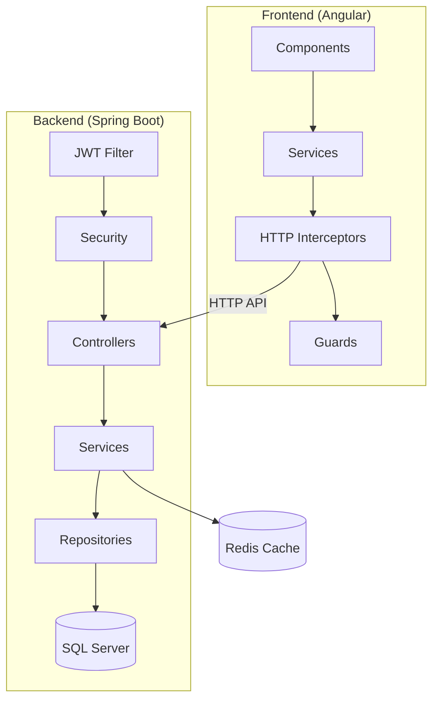
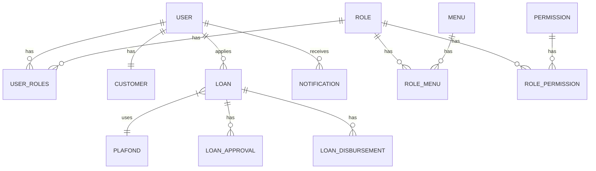
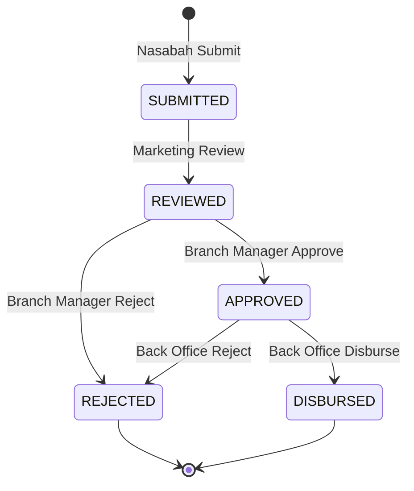

# Finprov2 - Loan Management System (Plapofy)

## Overview

**Plapofy** adalah sistem manajemen pinjaman (Loan Management System) yang dibangun dengan arsitektur modern full-stack:

- **Backend**: Spring Boot 3.4.1 dengan Java 17
- **Frontend**: Angular 19+ dengan Tailwind CSS
- **Database**: Microsoft SQL Server
- **Caching**: Redis

---

## Arsitektur Proyek



---

## Struktur Folder

### Backend (`src/main/java/com/finprov/loan`)

| Folder | Deskripsi |
|--------|-----------|
| `config/` | Konfigurasi aplikasi (Redis, OpenAPI, DataInitializer) |
| `controller/` | 13 REST Controllers untuk berbagai endpoint |
| `dto/` | 16 Data Transfer Objects untuk request/response |
| `entity/` | 15 JPA Entities (User, Role, Loan, Plafond, dll) |
| `repository/` | 13 Spring Data JPA Repositories |
| `security/` | JWT Authentication & Security Config |
| `service/` | 11 Service interfaces + implementasi |

### Frontend (`frontend/src/app`)

| Folder | Deskripsi |
|--------|-----------|
| `core/components/` | Shared components (Layout, NotificationCenter) |
| `core/services/` | 9 Angular services untuk API calls |
| `core/guards/` | Auth & Role guards untuk routing |
| `core/interceptors/` | HTTP interceptors untuk JWT |
| `features/` | 10 Feature modules (auth, dashboard, loans, dll) |

---

## Entity Diagram



---

## Alur Loan (Pinjaman)



### Status Loan

| Status | Deskripsi |
|--------|-----------|
| `DRAFT` | Loan belum disubmit |
| `SUBMITTED` | Nasabah sudah mengajukan |
| `REVIEWED` | Marketing sudah mereview |
| `APPROVED` | Branch Manager sudah approve |
| `DISBURSED` | Dana sudah dicairkan |
| `REJECTED` | Ditolak |

---

## Role-Based Access Control (RBAC)

### Roles

| Role | Akses |
|------|-------|
| `SUPER_ADMIN` | Full access, user/role management |
| `MARKETING` | Review loan applications |
| `BRANCH_MANAGER` | Approve/Reject loans |
| `BACK_OFFICE` | Disburse/Reject approved loans |
| `NASABAH` | Submit loan applications, simulation |

### Frontend Route Guards

```typescript
// Contoh dari app.routes.ts
{
    path: 'analytics',
    canActivate: [authGuard, roleGuard],
    data: { roles: ['ROLE_SUPER_ADMIN', 'ROLE_MARKETING', 'ROLE_BRANCH_MANAGER', 'ROLE_BACK_OFFICE'] }
}
```

### Backend Security

```java
// Contoh dari LoanController.java
@PostMapping
@PreAuthorize("hasRole('NASABAH')")
public ResponseEntity<ApiResponse<Loan>> submitLoan(@RequestBody SubmitLoanRequest request)

@PatchMapping("/{id}/approve")
@PreAuthorize("hasRole('BRANCH_MANAGER')")
public ResponseEntity<ApiResponse<Loan>> approve(@PathVariable Long id)
```

---

## API Endpoints

### Authentication (`/api/auth`)

| Method | Endpoint | Deskripsi |
|--------|----------|-----------|
| POST | `/login` | Login user, return JWT |
| POST | `/register` | Registrasi user baru (role: NASABAH) |
| POST | `/reset-password` | Reset password |
| POST | `/logout` | Logout |

### Loans (`/api/loans`)

| Method | Endpoint | Deskripsi | Role |
|--------|----------|-----------|------|
| GET | `/` | List semua loan | Authenticated |
| GET | `/{id}` | Detail loan | Authenticated |
| POST | `/` | Submit loan | NASABAH |
| POST | `/submit-kyc` | Submit dengan KYC | NASABAH |
| POST | `/simulate` | Simulasi pinjaman | Public |
| PATCH | `/{id}/review` | Review loan | MARKETING |
| PATCH | `/{id}/approve` | Approve loan | BRANCH_MANAGER |
| PATCH | `/{id}/disburse` | Disburse loan | BACK_OFFICE |
| PATCH | `/{id}/reject` | Reject loan | BRANCH_MANAGER, BACK_OFFICE |

### Users, Roles, Permissions, Menus

| Prefix | Role Required |
|--------|---------------|
| `/api/users` | SUPER_ADMIN |
| `/api/roles` | SUPER_ADMIN |
| `/api/permissions` | SUPER_ADMIN |
| `/api/menus` | SUPER_ADMIN |

---

## Key Files

### Backend

| File | Deskripsi |
|------|-----------|
| [LoanManagementApplication.java](file:///c:/Users/prasa/Desktop/BootcampITDP12/finprov2%20-%20Copy/src/main/java/com/finprov/loan/LoanManagementApplication.java) | Main Spring Boot application |
| [SecurityConfig.java](file:///c:/Users/prasa/Desktop/BootcampITDP12/finprov2%20-%20Copy/src/main/java/com/finprov/loan/security/SecurityConfig.java) | JWT security configuration |
| [LoanServiceImpl.java](file:///c:/Users/prasa/Desktop/BootcampITDP12/finprov2%20-%20Copy/src/main/java/com/finprov/loan/service/impl/LoanServiceImpl.java) | Business logic untuk loan |
| [DataInitializer.java](file:///c:/Users/prasa/Desktop/BootcampITDP12/finprov2%20-%20Copy/src/main/java/com/finprov/loan/config/DataInitializer.java) | Seed data untuk roles, users, plafonds |
| [application.yml](file:///c:/Users/prasa/Desktop/BootcampITDP12/finprov2%20-%20Copy/src/main/resources/application.yml) | Konfigurasi database & JWT |

### Frontend

| File | Deskripsi |
|------|-----------|
| [app.routes.ts](file:///c:/Users/prasa/Desktop/BootcampITDP12/finprov2%20-%20Copy/frontend/src/app/app.routes.ts) | Routing dengan lazy loading |
| [auth.service.ts](file:///c:/Users/prasa/Desktop/BootcampITDP12/finprov2%20-%20Copy/frontend/src/app/core/services/auth.service.ts) | Authentication service |
| [loan.service.ts](file:///c:/Users/prasa/Desktop/BootcampITDP12/finprov2%20-%20Copy/frontend/src/app/core/services/loan.service.ts) | Loan API service |
| [layout.component.ts](file:///c:/Users/prasa/Desktop/BootcampITDP12/finprov2%20-%20Copy/frontend/src/app/core/components/layout/layout.component.ts) | Sidebar & header layout |
| [dashboard.component.ts](file:///c:/Users/prasa/Desktop/BootcampITDP12/finprov2%20-%20Copy/frontend/src/app/features/dashboard/dashboard.component.ts) | Loan applications dashboard |

---

## Fitur Utama

### 1. **Authentication & Authorization**
- JWT-based authentication
- Role-based access control
- Protected routes dengan guards

### 2. **Loan Management**
- Submit loan dengan/tanpa KYC documents
- Loan simulation (calculate interest, installment)
- Workflow: Submit → Review → Approve → Disburse

### 3. **KYC (Know Your Customer)**
- Upload KTP, Selfie, NPWP, Business License
- KYC status tracking (PENDING, VERIFIED, REJECTED)

### 4. **Notifications**
- In-app notification center
- Notifikasi untuk setiap perubahan status loan

### 5. **Admin Features** (SUPER_ADMIN only)
- User Management
- Role Management
- Menu Management
- Permission Management

### 6. **Dashboard Analytics**
- Total loans, pending review, approved, disbursed, rejected
- Time range filters (Monthly, Quarterly, Semester, Yearly)

---

## Tech Stack Detail

### Backend Dependencies (pom.xml)

| Dependency | Version | Purpose |
|------------|---------|---------|
| Spring Boot | 3.4.1 | Framework |
| Spring Data JPA | - | ORM |
| Spring Security | - | Authentication |
| JJWT | 0.11.5 | JWT tokens |
| Spring Data Redis | - | Caching |
| Springdoc OpenAPI | 2.8.3 | API documentation |
| MS SQL JDBC | - | Database driver |
| Lombok | - | Boilerplate reduction |

### Frontend Dependencies

| Dependency | Purpose |
|------------|---------|
| Angular 19+ | Frontend framework |
| Tailwind CSS | Styling |
| Lucide Icons | Icon library |
| RxJS | Reactive programming |

---

## Running the Application

### Backend
```bash
cd "c:\Users\prasa\Desktop\BootcampITDP12\finprov2 - Copy"
mvn spring-boot:run
```
> Server runs on `http://localhost:8081`

### Frontend
```bash
cd "c:\Users\prasa\Desktop\BootcampITDP12\finprov2 - Copy\frontend"
ng serve
```
> Frontend runs on `http://localhost:4200`

### Database
- SQL Server on `localhost:1433`
- Database: `Plapofy`
- Username: `sa`
- Password: `123456`

---

## Default Users (DataInitializer)

| Username | Role | Password |
|----------|------|----------|
| admin | SUPER_ADMIN | admin123 |
| marketing | MARKETING | (check DataInitializer) |
| manager | BRANCH_MANAGER | (check DataInitializer) |
| backoffice | BACK_OFFICE | (check DataInitializer) |
| nasabah | NASABAH | (check DataInitializer) |

---

## Summary

Proyek **Plapofy** adalah sistem manajemen pinjaman yang lengkap dengan:

1. ✅ **Full-stack architecture** (Spring Boot + Angular)
2. ✅ **JWT authentication** dengan role-based access
3. ✅ **Complete loan workflow** (Submit → Review → Approve → Disburse)
4. ✅ **KYC document handling**
5. ✅ **In-app notifications**
6. ✅ **Admin panel** untuk user/role management
7. ✅ **Swagger API documentation** (`/swagger-ui.html`)
8. ✅ **Responsive UI** dengan Tailwind CSS
